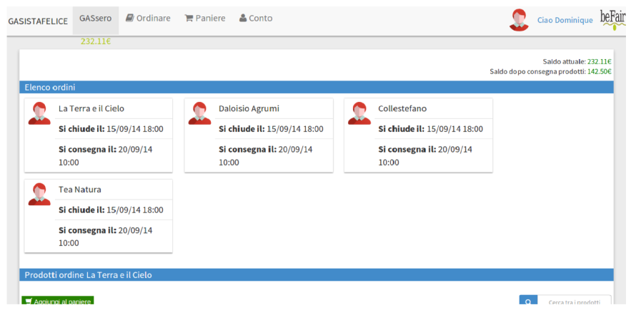

# Gasista Felice

[Gasista Felice](http://www.gasistafelice.org/) è una piattaforma per gestire gli scambi economici solidali in un territorio, detto Distretto di Economia Solidale (DES), ed e' stato inizialmente sviluppato per il [DES Macerata](http://ordini.desmacerata.it/).

In un DES il distacco tra produttori e consumatori viene superato grazie un rapporto fiduciario tra il Gruppo di Acquisto Solidale (GAS) e il fornitore:  è il cosiddetto *Patto di Solidarietà*, che consente di sviluppare l'economia delle relazioni nei territori.

Gasista Felice consente:

1. ai **referenti fornitori** di gestire in modo semplice gli ordini, inclusi la pianificazione, l'invio dei documenti di ordine, la decurtazione dal conto gasisti e la registrazione delle fatture;
2. ai **GAS** di *siglare* patti di solidarietà con i fornitori, di effettuare ordini InterGAS e di avere la visione del DES cui appartengono;
3. ai **fornitori** di gestire i propri listini e proporli a tutto il DES;
4. ai **gasisti** di ordinare con un click e di appoggiarsi ad un conto prepagato nel GAS;
5. ai **referenti economici** di registrare i pagamenti ai fornitori, di gestire quote, ricariche e donazioni al GAS

Per rendere più fruibile il software stiamo sviluppando
una nuova interfaccia grafica con cui i gasisti potranno ordinare anche da cellulare!
vi mettiamo alcune immagini di seguito.

Elenco degli ordini aperti:

Gestione dei prodotti ordinati:

Ordine da cellulare:

Questo è uno dei programmi che stiamo sviluppando per sostenere i territori con passione e una retribuzione equa.
Se vuoi vienici a trovare su [www.befair.it](http://www.befair.it) - ... in fase di aggiornamento ;)

## Quickstart

Se vuoi provare Gasista Felice puoi scrivere a dev@gasistafelice.org per avere accesso ad una installazione di test.
Se invece preferisci installarlo su un tuo server segui la **[guida di installazione](doc-dev/source/INSTALL.rst)**.

## Autori

* `Luca Ferroni <luca@befair.it>`
* `Dominque Thual <dom_thual@yahoo.fr>`
* `Lorenzo Franceschini <lorenzo.franceschini@informaetica.it>`
* `Matteo Micheletti <marko@befair.it>`
* `Riccardo Pancotti`
* `Francesco Spegni`

## Licenza

[GNU AGPLv3](./LICENSE.md)
