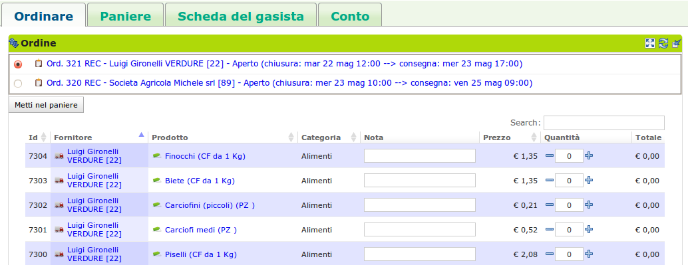
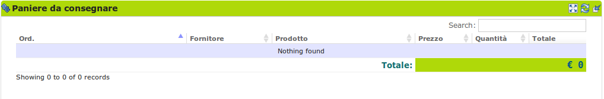

.. _role-gasmember:

Il gasista
==========

|head2_descr|
-------------

Il |res_gasmember| è una persona che appartiene ad un :ref:`GAS <resource-gas>`. 
Lo scopo del |res_gasmember| è ordinare prodotti, resi disponibili in un :ref:`ordine <resource-order>` aperto da un :ref:`referente fornitore <role-gasreferrersupplier>`.

Le tipiche attività del |res_gasmember| comprendono:

* ordinare i prodotti;
* visualizzare il paniere contenente i prodotti ordinati;
* confermare i prodotti, se previsto nel modo di operare del |res_gas|.
  
.. NOTE::
   |project_short_name| consente ad una persona di appartenere a più |res_gas| contemporaneamente.

|head2_actions|
---------------

Entra con nome utente e password
^^^^^^^^^^^^^^^^^^^^^^^^^^^^^^^^^^^^^^^^^^^^

Nella pagina iniziale del sito, un utente inserisce il nome utente e la password. In questo modo il sistema può identificare l'utente, consentirgli di ordinare e di fare tutte le azioni corrispondenti ai ruoli che riveste.

È solo dopo aver messo nome utente e password che il sistema sa se l'utente è un "semplice" gasista, un referente fornitore, un fornitore, un referente economico o un referente informatico del GAS.

.. figure:: _static/login.png
    :alt: Schermata di autenticazione
    :align: center

    Pagina iniziale: l'utente inserisce nome utente e password.

Ordina
^^^^^^^^^

Il gasista accede direttamente alla pagina con il listino dei prodotti ordinabili. La lista dei prodotti che si trova davanti è quella degli ordini aperti per il suo GAS (se solo un ordine o se listino misto di più ordini, questo è deciso dal referente informatico).

Dei prodotti che si trova davanti, il gasista dovrà impostare la quantità richiesta e eventualmente inserire delle note (ad esempio: "tagliato fino", "se possibile già pulito")

Premendo il bottone "Metti nel paniere" i prodotti selezionati andranno nel paniere.

    Gestione del paniere: permette l'inserimento dei prodotti che si vuole ordinare

Gestisce il proprio paniere
^^^^^^^^^^^^^^^^^^^^^^^^^^^^^^^^^

Una volta ordinati i prodotti è possibile visualizzarli nella scheda paniere --> blocco paniere.

.. figure:: _static/basket.png
    :alt: Schermata di gestione del paniere
    :align: center

    Paniere dei prodotti ordinati: permette la modifica/eliminazione/conferma dei prodotti ordinati

Se il gas lo richiede è necessario confermare i prodotti ordinati. 

Una volta che l'ordine è chiuso, i prodotti passano dal "paniere" al "paniere da consegnare". A questo punto non resta che attendere la consegna dei prodotti! Quantità e note non sono più modificabili.

    Paniere dei prodotti in consegna: visualizza i prodotti da ricevere. Non modificabili

Modifica la propria scheda gasista
^^^^^^^^^^^^^^^^^^^^^^^^^^^^^^^^^^^^^^^^^^^

Il gasista può modificare le informazioni relative al proprio profilo utente: nome, cognome, indirizzo, recapiti.

Nella scheda del gasista troviamo due riquadri (blocchi): VERIFICAscheda del gasista e scheda della persona. Il primo contiene informazioni relative all'appartenenza della persona in un GAS, l'altro le informazioni relative alla persona nel suo complesso.

In questo secondo blocco è possibile anche cambiare la propria password

.. figure:: _static/gas_member_info.png
    :alt: Scheda del gasista
    :align: center

    Visualizzazione e gestione informazioni del profilo utente

|head2_terms|
-------------

Breve definizione dei termini:

* Ordine: l'ordine che il referente fornitore apre, chiude ed invia al Fornitore con i prodotti ordinati dai gasisti
* Consegna
* Paniere: l'insieme dei prodotti ordinati per gli ordini aperti
* Paniere da consegnare: l'insieme dei prodotti ordinati negli ordini attualmente chiusi e da consegnare
* Fornitore: soggetto che fornisce un GAS
* Prezzo ordinato: prezzo di un prodotto al momento dell'ordine
* Prezzo consegnato: prezzo di un prodotto al momento della consegna

|head2_start|
-------------

Il gasista non deve pensare a curare i seguenti aspetti che sono di competenza di altri ruoli:

* :ref:`GAS <resource-gas>` già inserito
* :ref:`Fornitori <resource-supplier>` già inseriti
* :ref:`Patto di solidarietà <resource-pact>` già costituito
* :ref:`Ordine <resource-order>` già aperto
