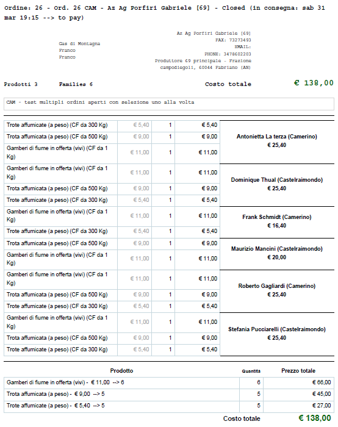

.. _role-gasreferrersupplier:

Il referente fornitore
======================

|head2_descr|
-------------

Il referente fornitore è un :ref:`gasista <role-gasmember>` responsabile di un :ref:`patto di solidarietà <resource-pact>` che esprime la relazione tra il :ref:`GAS <resource-gas>` e uno specifico :ref:`fornitore <role-supplier>`.
Il referente fornitore si occupa di aprire e gestire un ordine per il |res_pds| di cui è referente, in modo che i gasisti possano ordinare i beni offerti dal |res_supplier|. 
Inoltre può disabilitare alcuni prodotti disponibili nel listino del |res_supplier|, ma che il |res_gas| non intende acquistare.

Le tipiche attività del referente fornitore comprendono:

* visualizzazione del riepilogo dell'ordine;
* stampa del report dell'ordine sotto forma di file pdf;
* apertura dell'ordine;
* gestione del patto di solidarietà tra un |res_gas| ed un |res_supplier|.

|head2_actions|
---------------

* Apre l'ordine
* Decide all'apertura dell'ordine se inviare o no un email al FORUM del GAS

* Chiude ordine
* Decide alla chiusura se mandare o no un email al produttore

|head2_terms|
-------------

* Ordine
* Consegna

|head2_start|
-------------

* :ref:`Patto di solidarietà <resource-pact>` già instaurato

* CRON: esiste un automantismo che permette di inviare un email sul FORUM del GAS per avvertire della prossima chiusura di un ordine. L'evento aggrega varie ordini che soddisfanno la stessa regola.

Gestione di una consegna
++++++++++++++++++++++++

Alla chiusura della consegna il documento che raggruppa tutti ordini prenotati dai varie gasisti puo essere elaborato. Questo documento si chiama il report di consegna. 

.. _Documento_ordine:

    Documento di tipo PDF che aggrega le prenotazione gasisti

Il documento di consegna è MONO produttore. 

Il Documento presenta 2 griglie: per famiglia e per prodotto

1) Una griglia che presenta le prenotazione per famiglia con i relativi sotto totale per ciascun famiglia

2) Una griglia che aggrega le prenotazione per prodotto con il sotto totale per ogni prodotto

Ovviamente il totale di ciascun griglia è uguale al totale delle prenotazione presente in alto è in basso del documento.

Nella testata del documento si vedono i dati dell'ordine e i relativi soggetti che partecipano:
- Il numero dell'ordine
- Il produttore
- Varie date e i dati per rintracciare il produttore
_ Il referente e i dati per contattarlo in caso di bisogno

[FAQ] Un prodotto non è stato consegnato
