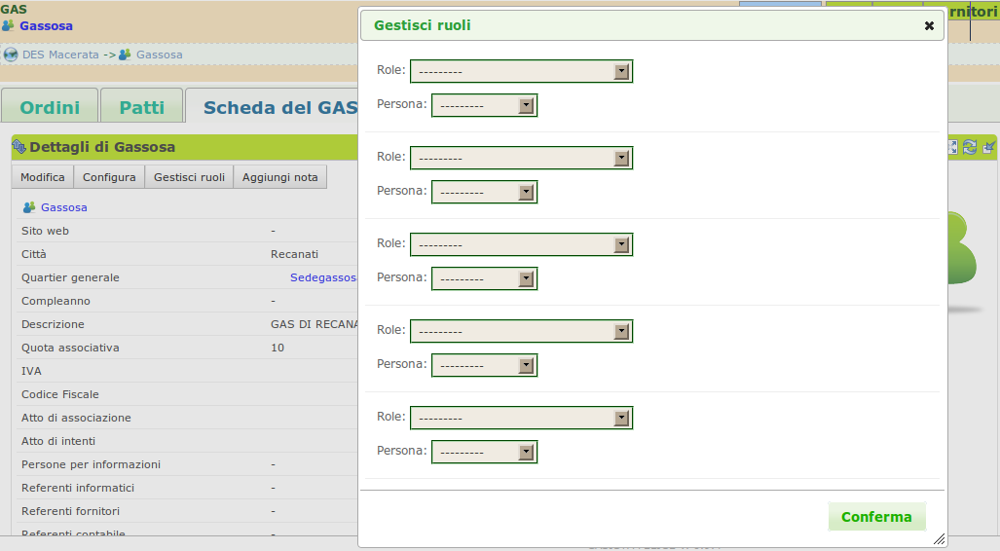
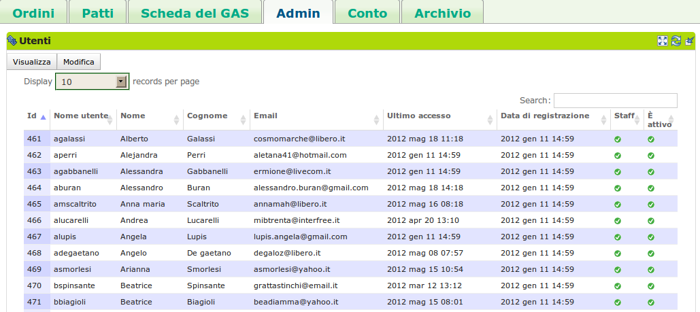
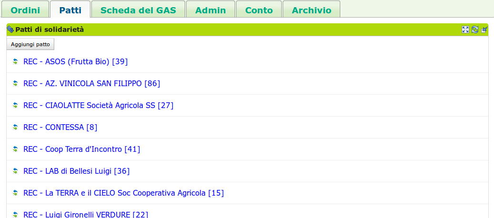

.. _role-gasreferrertech:

Il referente informatico del GAS
================================

|head2_descr|
-------------

Il referente informatico del :ref:`GAS <resource-gas>`  è un :ref:`gasista <role-gasmember>` che si occupa dell'amministrazione informatica del sistema, limitatamente agli aspetti relativi al |res_gas| di appartenenza.
È suo compito impostare il modo in cui i gasisti ordinano i prodotti, la sede, la quota di adesione, il luogo di consegna predefinito e altre caratteristiche del |res_gas|. 
È sempre lui che assegna i ruoli agli altri gasisti, in modo che essi possano eseguire le azioni di loro competenza.

.. WARNING::
    Il referente informatico del GAS è un utente che ha ampi margini di azione nel software.
    Può infatti eseguire molte delle operazioni eseguibili dal referente informatico del DES.
    Tale possibilità richiede una certa attenzione nell'interazione con la piattaforma.

|head2_actions|
---------------

Configurare il GAS
^^^^^^^^^^^^^^^^^^

Una volta che un nuovo |res_gas| viene inserito, è possibile configurarlo tramite la scheda  di configurazione del |res_gas| secondo le proprie esigenze, in modo da adeguare il software all'**identità del prprio GAS**. 

Un GAS può essere configurato in due modi:

* andando nella pagina del |res_gas|, nella "Scheda del GAS" -->  blocco Dettagli premendo il pulsante Configura;
* da menù contestuale del |res_gas|

In un |res_gas| è possibile configurare:

* luogo e giorno predefinito del ritiro dei prodotti;
* modalità di visualizzazione dei prodotti;
* la possibilità di confermare in mamiera automatica gli ordini dei gasisti;
* alcuni opzioni di selezione e filtraggio su ordini e consegne.

.. figure:: _static/gas_config.png
    :alt: Pannello di configurazione di un GAS
    :align: right

    Pannello di configurazione del |res_gas|

Assegna i ruoli
^^^^^^^^^^^^^^^^^^^^^

All'interno di ogni |res_gas| i singoli gasisti possono rivestire vari ruoli, e un ruolo può essere attribuito a più di un |res_gasmember|.

Il referente informatico ha il compito di gestire l'assegnazione dei ruoli all'interno del proprio |res_gas|. I ruoli che è possibile assegnare ad un |res_gasmember| sono :

* referente informatico;
* referente fornitore;
* referente economico;
* fornitore. 

Il referente informatico può assegnare i ruoli ai gasisti dalla schermata che ottiene nella scheda Scheda del GAS --> blocco Dettagli cliccando sul bottone Gestisci Ruoli. Nella schermata risultante il referente fornitore potrà scegliere:

* quale gasista rivestirà il nuvo ruolo; 
* il ruolo da assegnare al gasista.

    Schermata che offre i dettagli del |res_gas| e la possibilità di modificarlo e configurarlo.

Abilitare un gasista
^^^^^^^^^^^^^^^^^^^^^

L'iscrizione di un utente a |project_short_name| è solo il primo passo necessario all'iscrizione ad un |res_gas|. Infatti per poter entrare attivamente in un |res_gas| e cominciare a ordinare, un utente registrato necessita l'abilitazione da parte del referente informatico del |res_gas| a cui è interessato a partecipare.

Il referente informatico può gestire l'abilitazione degli utenti registrati che la richiedono dalla scheda Admin --> blocco Utenti cliccando sul bottone Modifica, selezionado o deselezionando (nel caso voglia disabilitare un |res_gasmember| ) la voce "è attivo" nella riga che corrisponde all'utente.

    Visualizza e permette l'abilitazione degli utenti che fanno parte del |res_gas|

.. include:: actions/add_supplier.rst

Aggiungere un patto di solidarietà
^^^^^^^^^^^^^^^^^^^^^^^^^^^^^^^^^^

Nel caso in cui in un |res_gas| non dovessero esservi referenti fornitori, il referente informatico è abilitato ad aprire un |res_pds| a cui in seguito verrà associato un |res_gasmember| con il ruolo di referente fornitore. Il referente informatico è comunque abilitato alla creazione di un |res_pds| anche nel caso in cui dei referenti fornitori fossero già presenti nel |res_gas|.

Il referente informatico può creare un nuovo |res_pds| nella scheda Patti --> Patti di solidarietà premendo il bottone "Aggiungi Patto", che apre una schermata in cui andranno inseriti:

* |res_supplier|
* data dell'accordo
* l'importo minimo per l'apertura dell'ordine
* alcuni dati sulla consegna
* uno o piu referenti fornitori per il |res_pds|

    Visualizza e permette l'aggiunta dei Patti di solidarietà tra il |res_gas| e un |res_suppier|

|head2_terms|
-------------

* |res_gas|
* Configurazione del |res_gas|
* Contatti del |res_gas|

|head2_start|
-------------

Il referente informatico del |res_gas| trova già inserito nel sistema il proprio |res_gas|.

