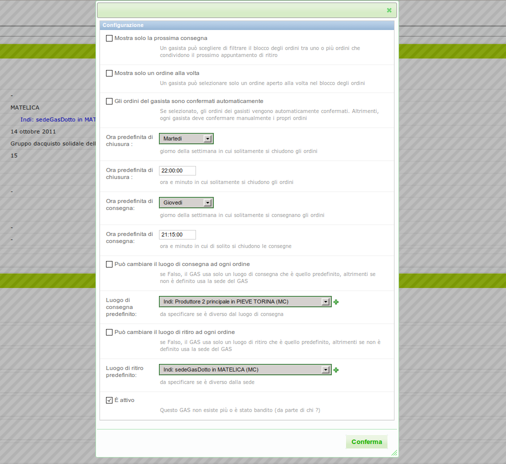

Il referente informatico del GAS
================================

.. WARNING::
    Il referente informatico del GAS è un utente che ha ampi margini di azione nel software.
    Può infatti eseguire molte delle operazioni eseguibili dal referente informatico del DES.
    Tale possibilità richiede una certa attenzione nell'interazione con la piattaforma.

|head2_descr|
-------------

Il referente informatico del GAS ha il `dominio` del proprio GAS.
Ciò vuol dire che ha il diritto di modificare tutto ciò che riguarda il suo GAS.
Come ogni altro ruolo, può essere attribuito a più utenti, nel caso in un GAS ci fosse
più di un referente informatico.

Oltre al referente informatico del GAS, solo il referente informatico del DES è
abilitato a gestire in tutto e per tutto ciò che riguarda il GAS.

|head2_terms|
-------------

* Configurazione del GAS
* Contatti del GAS

|head2_start|
-------------

Il referente informatico del GAS trova già inserito nel sistema il proprio GAS.

|head2_homepage|
-----------------

La sua pagina iniziale è quella relativa al GAS. Nel pannello "Scheda del GAS" 
egli può modificare le opzioni del GAS e gestire i ruoli dei gasisti.

|head2_actions|
---------------

Configurare il GAS
^^^^^^^^^^^^^^^^^^

La prima cosa da fare dopo aver inserito il tuo GAS è configurarlo secondo le vostre esigenze.
Grazie alla configurazione del GAS potrai adeguare il software all'**identità del tuo GAS** preimpostando
eventuali luogo e giorno predefinito del ritiro dei prodotti, la modalità in cui vengono visualizzati i prodotti,
e altro.

Un GAS si può configurare:

* andando nella pagina del GAS, nella "Scheda del GAS" e selezionando l'azione `Configura` nel blocco dettagli;
* da menù contestuale del GAS

Le opzioni di configurazione sono:

* TODO
* TODO
* TODO

I ruoli che possono aggiungere un fornitore nel DES sono:

* |sym_supplier_referrer|
* |sym_gas_referrer_tech|
* |sym_des_admin|

Abilitare i referenti
^^^^^^^^^^^^^^^^^^^^^

Per ogni GAS sono previsti vari ruoli cui è importante attribuire i referenti. 
Si possono impostare in maniera centralizzata i ruoli di referente informatico, referente fornitore, o gasista 

Il referente informatico può gestire tutti i ruoli dei gasisti
andando nella pagina del GAS, nella "Scheda del GAS" e selezionando l'azione `Gestisci ruoli` nel blocco dettagli.
 

Aggiungere un gasista
^^^^^^^^^^^^^^^^^^^^^

TODO

.. include:: actions/add_supplier.rst

Aggiungere un patto di solidarietà
^^^^^^^^^^^^^^^^^^^^^^^^^^^^^^^^^^

