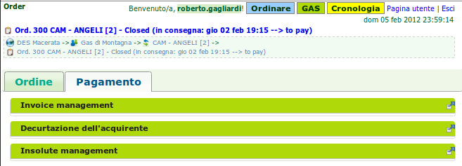
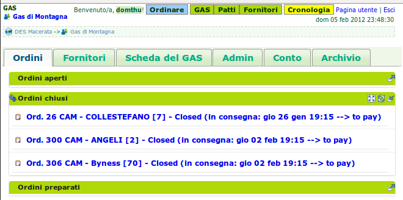
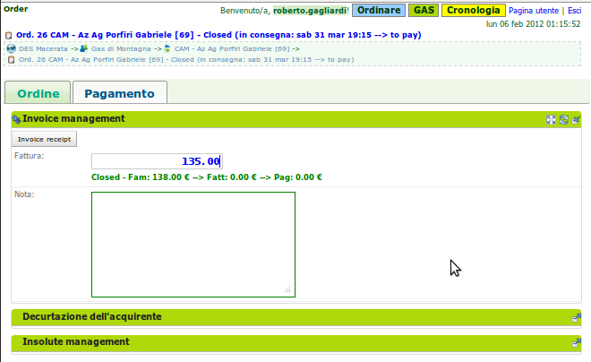
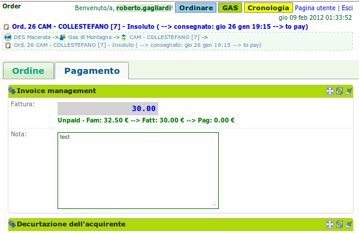
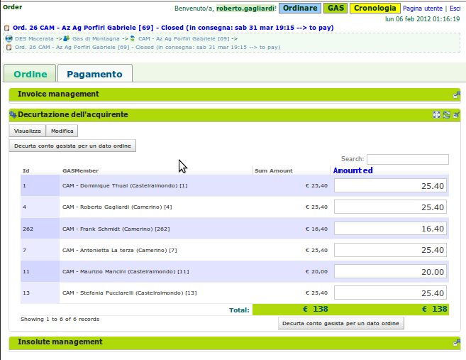
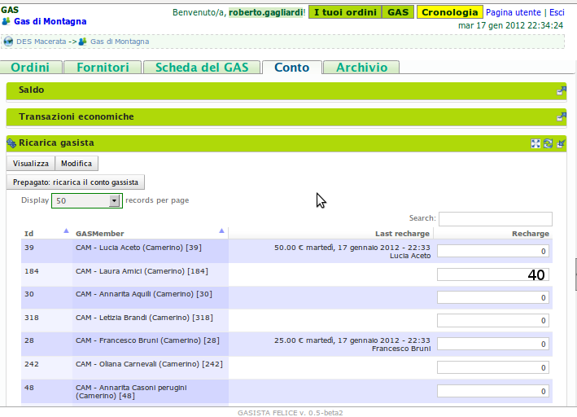
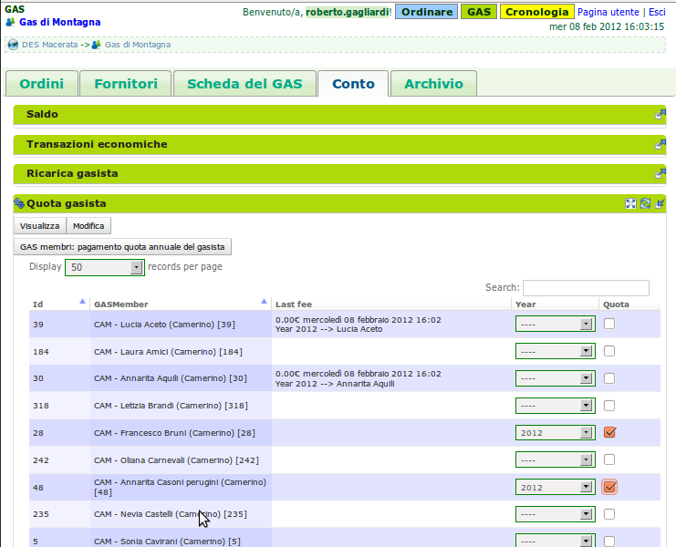

# Il referente contabile del GAS

## Descrizione

Il referente contabile è il responsabile della gestione economica del [GAS](resource_gas.md) e dei [gasisti](gas_member.md).
È suo compito registrare il pagamento degli ordini ai [fornitori](supplier.md), ricaricare i conti dei gasista a seguito di un versamento e registrare il pagamento delle quote associative dei gasista.

Può decurtare i conti dei gasista dell'importo dovuto per un ordine e registrare la fattura ricevuta.
Queste ultime due operazioni sono gestibili anche dai [referenti fornitori](gas_referrer_supplier.md) rispettivamente ai [patti di solidarietà](resource_pact.md) di cui sono referenti.

Il referente contabile ha visibilità completa di tutti i conti afferenti al GAS.

NOTA DI LUCA: IL SEGUITO è DA RIVEDERE (mettere nelle azioni?) - il primo impatto deve essere sintetico.

Il Referente Contabile gestisce i conti dei gasisti (che vanno a costituire la cassa del gas), le transazioni economiche con i Fornitori e il conto del GAS. Conosce, quindi, in qualsiasi momento lo stato economico di ogni soggetto partecipante alla retina.

All'interno di un GAS possono essere presenti più referenti economici.

Il Referente Economico deve:

* conoscere lo stato del conto di un gasista e correggere il suo conto;
* conoscere lo stato economico di un produttore e gestire le consegne effettuate ma che risultano ancora non pagate, cioè insolute.
* conoscere il saldo della cassa del GAS:
* differenziare nella cassa del GAS:

** la disponibilità effettiva del GAS, cioè i soldi del GAS detto anche il borsellino;
** l'ammontare dei depositi dei gasisti;
** il totale degli insoluti dovuti ai fornitori.

Il Referente Contabile conosce anche la cronologia dei flussi economici. Nel gas è sempre disponibile un ordinamento temporale del succedersi delle transazioni economiche.

## Azioni

### Gestione di un ordine

Da un punto di vista economico si fa in 3 steps separati:

1) Registra la Fattura di un ordine. ordine_invoice_

2) Decurta il totale famiglia per ciascun famiglie di un ordine. ordine_decurta_

3) Aggiunge una famiglia, inizialmente assente, e decurta il totale famiglia

.. _order_steps:

> Tab di gestione dei 3 steps per evadere un ordine chiuso

In pratica la consegna è già avvenuta. Per vari motivi (il produttore non riesce a soddisfare completamente la domanda, i prezzi subiscono un aggiornamento, la merce è di qualità inferiore alla media e il produttore decide di applicare uno sconto,..), le quantità/prezzi registrati al momento dell'invio dell'ordine possono differire da quelli effettivi, conoscibili solo al momento della consegna della merce da parte del produttore. Di conseguenza, il GAS dovrebbe verificare la corrispondenza tra ciò che viene ordinato e ciò che viene effettivamente consegnato (a livello di prezzi, quantità e, eventualmente, qualità).

Da una parte, questa verifica è importante sotto vari punti di vista: facilita la gestione del processo di consegna e della contabilità del GAS, permette di implementare delle procedure più robuste e resistenti agli errori umani, consente un monitoraggio più accurato dell'attività del GAS (cosa utile sia ai gasisti che nelle realizzazione di statistiche "aggregate" più rispondenti alla realtà) e della affidabilità dei Fornitori; dall'altra una gestione così granulare richiede ai Gasisti uno sforzo organizzativo/logistico che alcuni GAS (in particolare quelli di dimensioni più ridotte) non vogliono/possono sostenere. Quindi in questa fase del gestionale non scendiamo al livello del prodotto ma la parte economica si limita a registrare la somma totale che il gasista deve effettivamente sborsare per il produttore.

Da una consegna escono la fattura emessa dal produttore e il documento di consegna di tipo PDF che viene con una penna modificato a mano. Le modifiche portano solo sul totale economico per famiglia per produttore.

Un esempio di documento di consegna è visibile cui Documento_ordine .. seealso:: gas_referrer_supplier.rst

La fattura e il report di consegna modificato sono i 2 documenti che servono rispettivamente al punto 1) e 2) per evadere l'ordine

[FAQ] Risalire ai ordini chiusi da trattare economicamente:

E possibile vedere la lista degli ordini chiusi nella pagina del suo GAS

.. _ordini_chiusi:

> Griglia che elenca gli ordini chiusi

Cliccando su una riga si raggiunge la scheda dell'ordine dove è possibile nel tab **Pagamento** gestire la consegna economica

1) Registrazione fattura
si fa nella scheda dell'ordine

.. _ordine_invoice:

> riquadro per la registrazione della fattura di un ordine

Inserire l'ammontare richiesto dal produttore. Ovviamente è un valore positivo con centesimi.
Aggiungere note se necessario. Di solito viene annotato il numero della fattura del produttore o altre informazioni in modo da risalire al documento rilasciato. Questo documento varia in funzione del regime fiscale del produttore.

Cliccare su **Invoice receipt** per associare la richiesta di pagamento del produttore.

.. warning::

    Per un ordine un referente economico gestisce 3 totali:
        I -  Totale ordinato dalle famiglie e sommato: Totale prenotato

        II - L'ammontare richiesto dal produttore dopo avere consegnato:  Fattura emessa dal produttore

        III - Il totale sommato delle consegne realmente fatte alle famiglie: Totale famiglie decurtato

Si aggiunge il pagamento finale del produttore. Che potrà anche essere la somma di più ordini insoluti pagati insieme.

Queste 3 prime cifre sono idealmente uguali.

In pratica queste 3 cifre sono speso differente tra di loro. Ad esempio se il totale prenotato dalle famiglie del GAS si ammonta ad 100 euro di prodotti, ma, durante la consegna, il prezzo di alcuni prodotti è variabile con il peso o in altri casi mancano proprio dei prodotti al momento della consegna; in questi casi la fattura emessa dopo la consegna reale sarà sicuramente differente dal prenotato.

Altro esempio: il produttore consegna per 80,32 euro. Il produttore arrotonda la fattura per chiedere
80 euro. Il GAS decurterà effettivamente 80,32 euro alle varie famiglie. Il GAS registrerà la fattura e pagherà realmente 80 euro al produttore. Il GAS troverà nel suo borsellino un ammontare di 0,32 in più.

I casi per il quale queste 3 cifre divergono sono tante. In ogni modo il sistema proverà a mostrare queste 3 cifre, quando inserite nel sistema, in modo da aiutare il controllo e l'immissione da parte del referente. Questa indicazione si trova sotto la casella di inserimento del prezzo.

"Ordine chiuso: (I) Totale prenotato dalle famiglie --> (II) fattura richiesta dal Produttore --> (III) Pagamento effettivo del GAS"

Quando avete registrato la fattura il sistema non permette più di modificarla. Al momento del salvataggio il sistema controlla se avanzare o no lo stato dell'ordine da **Chiuso** a **Da pagare**

.. _order_invoiced:

> ordine chiuso con registrazione fattura effettuata

2) Decurta del conto gasista

La griglia presenta l'insieme delle persone che hanno prenotato durante l'apertura dell'ordine.
Di default il sistema presenta il totale previsto della prenotazione.
Ovviamente durante la consegna questa cifra per famiglia può variare per mille motivi.

E proprio in questa griglia che vengono gestite queste variazione. Se l'utente loggato dispone del ruolo economico o è il referente produttore di questo ordine allora appaiono 2 pulsanti **Visualizza** e **Modifica**

Cliccando su **Modifica** la griglia entra in modalità di editing

.. _ordine_decurta:

> Stato economico delle famiglie per un dato ordine

Il referente dell'ordine o uno dei referenti economico può sistemare ciascun famiglia secondo le informazione e il svolgersi della consegna.
 O aiutandosi dal foglio di consegna modificato a mano.

Una volta messa a posto tutte le famiglie da cui il totale consegnato varia, il referente clicca su **decurta conto gasista per un dato ordine** per creare le transazione economiche per tutte le famiglie.

Per ciascun famiglia viene creata una transazione economica dal conto del gasista verso la cassa del GAS.

[FAQ] Aggiungere una famiglia
Aggiungere una famiglia non compressa nel report al momento della chiusura ordine.
Succede speso che alcuni ritardatari possono ordinare dopo che il report del gestionale fu stato inviato al produttore. Succede che durante la consegna una famiglia a dato ad un altra alcuni prodotti. Succede che una famiglia ha contattato il produttore, direttamente o via il referente, per farci consegnare prodotti in più o non prenotati...

Per tutti questi casi si può aggiungere una famiglia alla decurtazione dell'ordine.

.. TODO

    non implementato ancora

Una volta fatto i punti 1) e 2) l'ordine passa allo stato evaso **Insoluto**. Cioè rimane appeso in attesa di essere pagato da un referente economico.

In pratica, speso gli ordini vengono pagato direttamente. Al volo. Pero succede che alcuni produttori vengono pagati dopo aver accumulato alcune consegne. Ad esempio se un produttore di verdure consegna ogni settimana ma, da accordo con il GAS, viene pagato solo una volta al mese, allora alla fine del mese, al momento di farci pagare, questo produttore ad accumulato 4 fatture. Sono 4 Insoluti. Questi 4 Insoluti vengono addizionati e mostrato a video per aiutare il referente economo ad rintracciare il totale insoluto.

La registrazione del pagamento archivia definitivamente un ordine.

### Ricarica di un Gasista

La gestione delle ricariche segue il modello del prepagato. Un gasista consegna soldi al referente economico che lo registra nel gestionale. La ricarica accredita il conto gasista.
 Il conto viene decurtato ad ogni consegna produttore. Non c'è scambio di moneta tra il referente produttore e il gasista.

La gestione delle ricariche è abilitata solo per i referenti economici
.
Un economico accede al riquadro delle ricariche GF-ECO-Ricarica_ andando su:
DES > pagina del GAS > tab Conto

La griglia delle ricariche presenta la lista dei gasisti del GAS.
Per ciascuno è evidenziato l'ultima ricarica fatta con la relativa data.
Cosi l'economico tiene sotto occhio le ricariche già fatte.

[FAQ] Ricaricare un gasista
Un referente economico vede i pulsanti di gestione: **Visualizza** e **Modifica**
Cliccando su **Modifica** la griglia passa in modalità di editing.
Appare una colonna *Recharge* dove è possibile inserire di fronte al nome del gasista l'importo da accreditare.
In questa modalità di editing appare anche un pulsante **Prepagato: ricarica il conto gasista**
Il referente economico ripete l'operazione per tutti gasisti da ricaricare lasciando vuoto l'inserimento da quelli da lasciare invariato.
Una volta inserito tutti gasisti da ricaricare, il referente economico preme su **Prepagato: ricarica il conto gasista**
La pagina viene rinfrescata e le somme vengono accreditate ad ciascun gasista. L'economico può controllare l'effettivo versamento scorrendo la colonna *Last recharge*.

.. _GF-ECO-Ricarica:

> Griglia per la gestione delle ricariche

### Quota dei gasisti

.. _GF-eco-quota:

> Griglia per la gestione delle quote dei gasisti

[FAQ] Pagamento della quota:

Solo un referente economico del GAS vede apparire i pulsanti di gestione della quota.

Un referente economico dispone dei pulsanti **Visualizza** e **Modifica**. Cliccando su **Modifica** il referente economico passa in modalità di editing la griglia. A questo punto è in grado di inserire il pagamento della quota per un gasista: La griglia

* Ogni riga rappresenta un gasista
* La colonna *Last fee* presenta l'ultima volta in cui è stato versato la quota per il relativo gasista
* Una scelta nella colonna *Anno* deve essere fatta per attivare la transazione
* Per attivare la transazione deve essere spuntato la checkbox di pagamento nella colonna *Quota*

Si ripete l'operazione per ogni gasista come desiderato: anno è flag di richiesta transazione.

Per creare le transazioni cliccare sul pulsante **GAS membri: pagamento quota annuale del gasista**

La quota è annuale. Ciascun GAS decide come gestirla. partendo dal calendario o dal momento del versamento effettivo di un gasista.

Il sistema deve prevedere se impostare la transazione prelevando dal conto del soggetto o se è solamente una transazione in **+** sul conto del GAS. In pratica questo secondo caso corrisponde ad un versamento in contante dal gasista per il pagamento della quota.

.. TODO::

    Il sistema non prevede rilancio sulla situazione del gasista. In un primo tempo il sistema potrà evidenziare le righe in sfondo rosso per un gasista che ha già versato almeno una quota e se l'ultima quota versata è superiore ad un hanno fa.

### Conti dei soggetti: Produttori

La visualizzazione del conto del soggetto produttore nel DES si trova:

* Scheda del produttore

* Un patto di solidarietà tra un GAS e il produttore

* Scheda del GAS nella parte economica

### Conti dei soggetti: Gasisti

.. warning::

   Conto gasista: Il conto del gasista somma i versamenti del prepagato meno le detrazione per gli ordini consegnati.

Il saldo economico di un gasista viene affiancato del totale delle prenotazione ancora modificabile (acquisti del paniere) e del totale delle prenotazione bloccate perché in corso di consegna.

Un conto gasista è soggetto a particolare transazione economiche. Ad esempio la correzione di errore. Queste sono fattibile solo dai referenti economici.

La visualizzazione del conto del soggetto gasista nel DES si trova:

* Scheda del gasista

* Scheda del GAS al quale aderisce nella parte economica mediante filtraggio.

### Conti dei soggetti: GAS cassa

La visualizzazione del conto del soggetto GAS nel DES si trova:

* Scheda del GAS

### Conti dei soggetti: GAS borsellino

La visualizzazione del conto del soggetto GAS nel DES si trova:

* Scheda del GAS

### Correggere una transazione

[FAQ] Ho sbagliato a ricaricare un gasista

L'economico non può ritornare su una transazione economica. In questo caso l'economico deve portare una correzione.

* Se l'ammontare da accreditare e superiore a quanto ricaricato, l'economico può procedere ad una seconda ricarica con la differenza mancante.

* Se l'ammontare accreditato sul conto è superiore a quanto sborsato realmente dal gasista allora rimane solo una correzione in negativo da portare sul conto gasista. cf. my-correct-gasmember_

.. _my-correct-gasmember:

.. TODO

    non implementato ancora

### Genera un bilancio annuale? (in futuro)

.. TODO

    FUTURE non previsto ancora

### Approfondire

.. seealso:: economic.rst

## Terminologia

I soggetti che compongono il Distretto di Economia Solidale sono
Gasista
GAS con la cassa = depositi gasisti + il suo proprio  borsellino
Produttore
Anonimo detto anche *NonDES*: uscita(spese di utenza) o entrata(introiti, incassi) dalla rete

Una transazione economica si verifica tra due o più soggetti.

Si identifica il Distretto di Economia Solidale basandosi sulla movimentazione delle transazione tra soggetti.

Se un gasista ricarica il suo conto. Si verifica un spostamento di monete tra il gasista e la cassa. Il saldo della rete rimane invariata.

Se il GAS paga un produttore. La rete verifica una perdita.

Il pagamento di una fattura o altre servizi esterni verificano un uscita.

### Gestione d'ordine

.. warning::

   regola: un ordine per un produttore

Nel gestionale un referente produttore ha la possibilità di gestire la decurtazione dei gasisti che hanno partecipato ad uno suo ordine e registrare la fattura emessa dal produttore. Varie operazione del cassiere possono essere affidate al respettivo responsabile di consegna di un ordine.

.. warning::

   L'economico non deve sapere niente della consegna. Interessa solo il totale monetario per ogni famiglia consegnata e l'ammontare della fattura.

Il sistema attuale non prevede che l'economico o il referente gestisce la consegna economica al livello del prodotto.
 il sistema si accontenta di movimentare il valore economico di prodotti consegnati per famiglia.

Nella gestione ordinaria di un ordine, l'economico deve eseguire 3 operazioni:
1 la registrazione della fattura
2 la decurtazione del totale famiglia per produttore: Prezzo ordinato / prezzo consegnato
L'operazione 2 viene eseguita n volte quante ci sono di famiglie avendo partecipato all'ordine
3 Il pagamento effettivo del produttore. Questa operazione è indipendente delle 2 prime e si può verificare dopo un tempo non prevedibile.

Il verificarsi dei punti 1 e 2, qualsiasi l'ordine di apparenza, provoca il cambio di stato dell'ordine in automatico. L'ordine passa dallo stato **CHIUSO** ad **CONSEGNATO** (*to pay*). L'ordine, che rimane solo da pagare per essere archiviato, entra in una fase di gestione degli insoluti che è il punto 3.

L'ordine diventa un insoluto che si somma ai ipotetici altri insoluti da pagare al produttore.

Il punto 3 è asincrono. Se il pagamento viene registrato insieme al punto 1 e 2 l' ordine cambio stato ad **ARCHIVIATO**.

Un ordine può essere annullato.  .. seealso:: gas_referrer_supplier.rst

.. warning::

   Un ordine archiviato non può essere modificato.
   Ogni modifica future, correzione gasista o pagamento, deve essere fatta tramite correzione.

Oltre all'economico di turno, il punto 1 e 2 possono essere effettuate dal referente produttore di quel ordine.

Oltre alla gestione dell'ordine, il referente economico deve poter effettuare le seguente operazioni:

1 entrata e uscita della propria cassa senza punto di ingresso o di arrivo.

2 correzione sugli soggetti attivi: gasista e produttori

## Da cosa parte

* Gestione di un ordine

* Ricarica del prepagato per i gasisti

* gestione delle quote annui per i gasisti

* Conto dei soggetti: visualizzazione dello stato, delle transazione e correzione economiche
