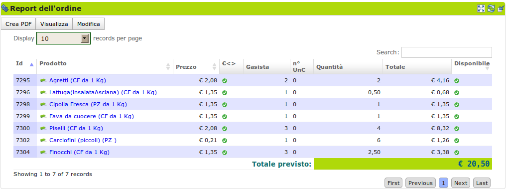
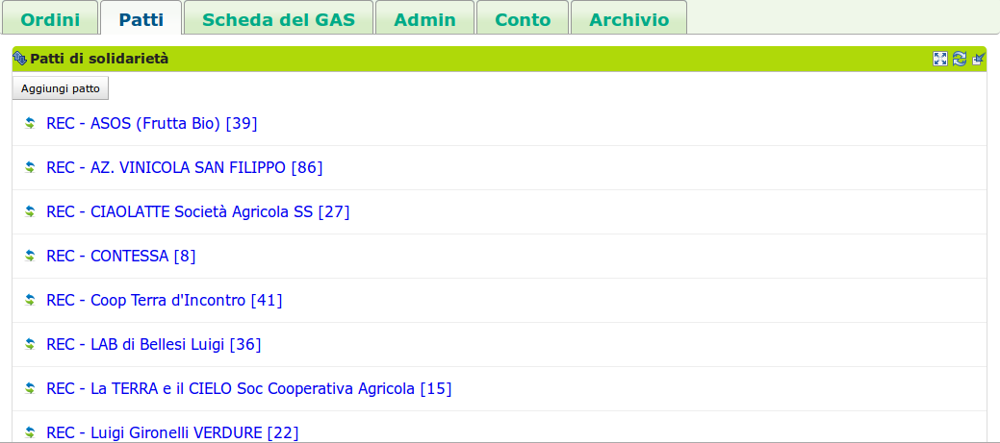
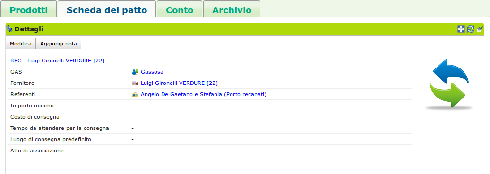

# Il referente fornitore

## Descrizione

Il referente fornitore è un [gasista](gas_member.md) responsabile di un [patto di solidarietà](resource_pact.md) che esprime la relazione tra il [GAS](resource_gas.md) e uno specifico [fornitore](supplier.md).

Il referente fornitore si occupa di aprire e gestire un ordine per il patto di solidarietà di cui è referente, in modo che i gasisti possano ordinare i beni offerti dal fornitore.

Inoltre può disabilitare alcuni prodotti disponibili nel listino del fornitore, ma che il GAS non intende acquistare per ragioni etiche o di altra natura.

Le tipiche attività del referente fornitore comprendono:
* visualizzazione del riepilogo dell'ordine;
* stampa del report dell'ordine sotto forma di file pdf;
* apertura dell'ordine;
* gestione del patto di solidarietà tra un GAS ed un fornitore.

## Azioni

Come accennato nella sezione precedente, le azioni del referente fornitore sono mirate a gestire le relazioni tra GAS e fornitore, con particolare attenzione alla gestione degli ordini dalla loro apertura fino alla chiusura.

La relazione GAS e fornitore prende il nome di patto di solidarietà.

### Apre l'ordine

Il  compito principale di un referente fornitore è di gestire gli ordini. Aprire un ordine, vuol dire rendere ordinabili dai gasisti un insieme di prodotti collegati ad un patto di solidarietà.

Per aprire un ordine il referente fornitore va nella scheda Ordini -> blocco Ordini aperti e preme il bottone "Aggiungi ordine". Si aprirà un modulo in cui potrà impostare:

* Patto di riferimento
* Data di apertura
* Data di chiusura
* Data di consegna (se previsto nella configurazione del GAS)
* Referente per l'ordine specifico
* PIanificazione con periodicità

L'ordine creato verrà automaticamente aperto se la data e l'ora sono precedenti alla data e ora attuali. Se invece la data è posteriore, l'ordine andrà in stato "preparato" e il sistema lo aprirà automaticamente al momento giusto.

> Schermata per l'apertura o la preparazione dell'ordine

Come detto, al momento dell'apertura è possibile pianificare vari ordini ed essi quindi saranno visibili fra gli ordini "preparati".

### Visualizza il riepilogo dell'ordine

Nella pagina relativa alla risorsa Ordine che si raggiunge cliccando sull'ordine, è possibile visualizzare gli ordini aggregati per prodotto nella scheda Ordine --> blocco Report dell'ordine.

> Qui è possibile creare il documento PDF che aggrega per prodotto le prenotazioni dei gasisti.

Il referente fornitore può stampare e visualizzare un file pdf con i prodotti ordinati.

Tale documento di ordine presenta 2 griglie:

1. una griglia con gli ordini aggregati per gasista con i relativi subtotali;
2. una griglia che aggrega gli ordini per prodotto con il subtotale per ogni prodotto.

L'intento di questa duplice aggregazione è di facilitare sia i fornitori che operano a prodotto, sia quelli che preparano i pacchi per gasista (= pacchi famiglia).

Questo è il documento di ordine da inviare al fornitore e risulterà utile anche in **fase di consegna** per verificare che i prodotti ordinati siano effettivamente consegnati e distribuiti alle famiglie che lo hanno richiesto.

Nella testata del documento si vedono i dati dell'ordine e i relativi soggetti che partecipano:

* Il numero dell'ordine;
* Il fornitore;
* varie date e i dati per rintracciare il produttore;
* il referente e i dati per contattarlo in caso di necessità.

.. TODO:
 Una delle prime funzionalità per proseguire è la proposta ai fornitori di un modello personalizzato per il report dell'ordine, in modo che sia il più congeniale possibile alle loro esigenze e quindi facilitare le operazioni.

### Chiude l'ordine

Al momento della chiusura dell'ordine il referente fornitore può inviare una mail al fornitore con il pdf descritto nella sezione precedente. L'invio avviene automaticamente se il fornitore ha configurato la propria Scheda fornitore in modo da richiedere questo servizio.

### Gestisce il patto di solidarietà

Nel patto di solidarietà si regolano i rapporti tra  il GAS e un fornitore.

Il referente fornitore può impostare tali aspetti che sono:

* la data dell'accordo
* il documento che regola i rapporti tra i due soggetti
* almeno un referente fornitore scelto fra i gasisti
* l'importo minimo per aprire un'ordine
* i costi di consegna (se previsti)
* i tempi di attesa per la consegna

> Schermata di creazione del Patto di solidarietà

Un patto di solidarietà può essere creato da un referente fornitore oppure dal referente informatico del GAS.

È possibile modificare tali impostazioni nella risorsa patto di solidarietà che si raggiunge cliccando sul patto. Da lì accedere alla Scheda del Patto --> blocco Dettagli e premere il bottone "Modifica"

> Blocco che consente la visualizzazione e la modifica dei dettagli del Patto

## Terminologia

Breve definizione dei termini:

* fornitore: soggetto che fornisce un GAS
* GAS: Gruppo di Acquisto Solidale
* Ordine: l'ordine che il referente fornitore apre, chiude ed invia al fornitore con i prodotti ordinati dai gasisti
* Prodotto: bene che un fornitore propone ad un GAS, è caratterizzato dal fornitore che lo produce e da una categoria di prodotto del DES
* Consegna: processo in cui un fornitore consegna fisicamente ad un GAS la merce relativa ad un ordine

## Da cosa parte

* [Patto di solidarietà](resource_pact.md) già instaurato
