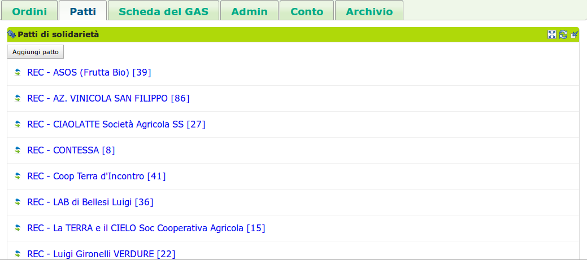
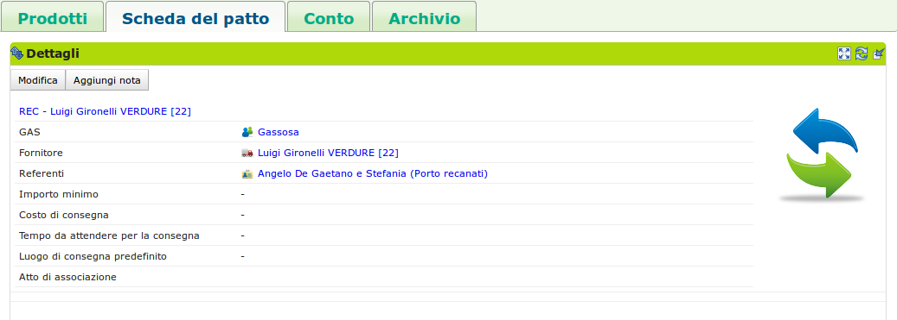

.. _role-gasreferrersupplier:

Il referente fornitore
========================

|head2_descr|
-------------

Il referente fornitore è un :ref:`gasista <role-gasmember>` responsabile di un :ref:`patto di solidarietà <resource-pact>` che esprime la relazione tra il :ref:`GAS <resource-gas>` e uno specifico :ref:`fornitore <role-supplier>`.

Il referente fornitore si occupa di aprire e gestire un ordine per il |res_pds| di cui è referente, in modo che i gasisti possano ordinare i beni offerti dal |res_supplier|. 

Inoltre può disabilitare alcuni prodotti disponibili nel listino del |res_supplier|, ma che il |res_gas| non intende acquistare per ragioni etiche o di altra natura. 

Le tipiche attività del referente fornitore comprendono:
* visualizzazione del riepilogo dell'ordine;
* stampa del report dell'ordine sotto forma di file pdf;
* apertura dell'ordine;
* gestione del patto di solidarietà tra un |res_gas| ed un |res_supplier|.

|head2_actions|
---------------

Come accennato nella sezione precedente, le azioni del referente fornitore sono mirate a gestire le relazioni tra |res_gas| e |res_supplier|, con particolare attenzione alla gestione degli ordini dalla loro apertura fino alla chiusura.

La relazione |res_gas| e |res_supplier| prende il nome di |res_pds|.

Apre l'ordine
^^^^^^^^^^^^^^^^^
Il  compito principale di un referente fornitore è di gestire gli ordini. Aprire un ordine, vuol dire rendere ordinabili dai gasisti un insieme di prodotti collegati ad un |res_pds|.

Per aprire un ordine il referente fornitore va nella scheda Ordini -> blocco Ordini aperti e preme il bottone "Aggiungi ordine". Si aprirà un modulo in cui potrà impostare:

* Patto di riferimento
* Data di apertura
* Data di chiusura
* Data di consegna (se previsto nella configurazione del GAS)
* Referente per l'ordine specifico
* PIanificazione con periodicità 

L'ordine creato verrà automaticamente aperto se la data e l'ora sono precedenti alla data e ora attuali. Se invece la data è posteriore, l'ordine andrà in stato "preparato" e il sistema lo aprirà automaticamente al momento giusto.

.. figure:: _static/open_orders.png
    :alt: Schermata di apertura dell'ordine
    :align: center
    
    Schermata per l'apertura o la preparazione dell'ordine
    
Come detto, al momento dell'apertura è possibile pianificare vari ordini ed essi quindi saranno visibili fra gli ordini "preparati".

Visualizza il riepilogo dell'ordine
^^^^^^^^^^^^^^^^^^^^^^^^^^^^^^^^^^^^^^^

Nella pagina relativa alla risorsa Ordine che si raggiunge cliccando sull'ordine, è possibile visualizzare gli ordini aggregati per prodotto nella scheda Ordine --> blocco Report dell'ordine.

.. figure:: _static/ord_report.png
    :alt: Qui è possibile creare il PDF che rissume i prodotti ordinati dai gasisti
    :align: center
    
    Qui è possibile creare il documento PDF che aggrega per prodotto le prenotazioni dei  gasisti.

Il referente fornitore può stampare e visualizzare un file pdf con i prodotti ordinati.

Tale documento di ordine presenta 2 griglie:

1. una griglia con gli ordini aggregati per gasista con i relativi subtotali;
2. una griglia che aggrega gli ordini per prodotto con il subtotale per ogni prodotto.

L'intento di questa duplice aggregazione è di facilitare sia i fornitori che operano a prodotto, sia quelli che preparano i pacchi per gasista (= pacchi famiglia).

Questo è il documento di ordine da inviare al fornitore e risulterà utile anche in **fase di consegna** per verificare che i prodotti ordinati siano effettivamente consegnati e distribuiti alle famiglie che lo hanno richiesto.

Nella testata del documento si vedono i dati dell'ordine e i relativi soggetti che partecipano:

* Il numero dell'ordine;
* Il fornitore;
* varie date e i dati per rintracciare il produttore;
* il referente e i dati per contattarlo in caso di necessità.

.. TODO:
 Una delle prime funzionalità per proseguire è la proposta ai fornitori di un modello personalizzato per il report dell'ordine, in modo che sia il più congeniale possibile alle loro esigenze e quindi facilitare le operazioni.

Chiude l'ordine
^^^^^^^^^^^^^^^^^

Al momento della chiusura dell'ordine il referente fornitore può inviare una mail al |res_supplier| con il pdf descritto nella sezione precedente. L'invio avviene automaticamente se il |res_supplier| ha configurato la propria Scheda fornitore in modo da richiedere questo servizio.

Gestisce il patto di solidarietà
^^^^^^^^^^^^^^^^^^^^^^^^^^^^^^^^^^^

Nel patto di solidarietà si regolano i rapporti tra  il |res_gas| e un |res_supplier|.

Il referente fornitore può impostare tali aspetti che sono:

* la data dell'accordo
* il documento che regola i rapporti tra i due soggetti
* almeno un referente fornitore scelto fra i gasisti
* l'importo minimo per aprire un'ordine
* i costi di consegna (se previsti)
* i tempi di attesa per la consegna

    
    Schermata di creazione del Patto di solidarietà
    
Un |res_pds| può essere creato da un referente fornitore oppure dal referente informatico del |res_gas|.

È possibile modificare tali impostazioni nella risorsa |res_pds| che si raggiunge cliccando sul patto. Da lì accedere alla Scheda del Patto --> blocco Dettagli e premere il bottone "Modifica"

    
    Blocco che consente la visualizzazione e la modifica dei dettagli del Patto

|head2_terms|
-------------

Breve definizione dei termini:

* |res_supplier|: soggetto che fornisce un |res_gas|
* |res_gas|: Gruppo di Acquisto Solidale 
* Ordine: l'ordine che il referente fornitore apre, chiude ed invia al |res_supplier| con i prodotti ordinati dai gasisti
* Prodotto: bene che un |res_supplier| propone ad un |res_gas|, è caratterizzato dal |res_supplier| che lo produce e da una categoria di prodotto del |res_des|
* Consegna: processo in cui un |res_supplier| consegna fisicamente ad un |res_gas| la merce relativa ad un ordine

|head2_start|
-------------

* :ref:`Patto di solidarietà <resource-pact>` già instaurato
