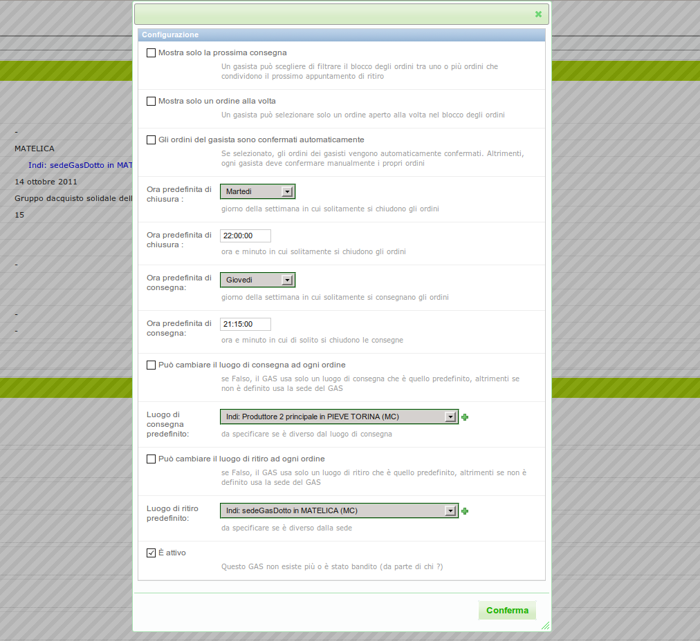
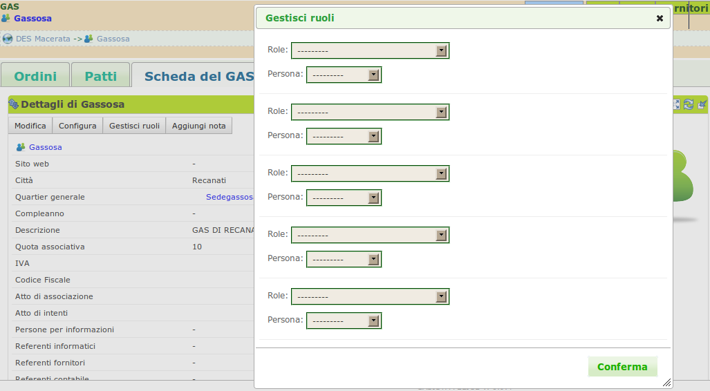
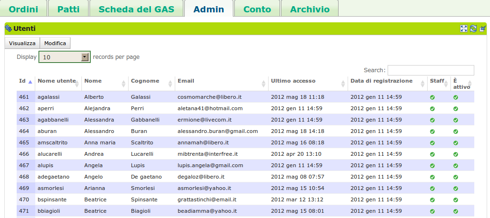
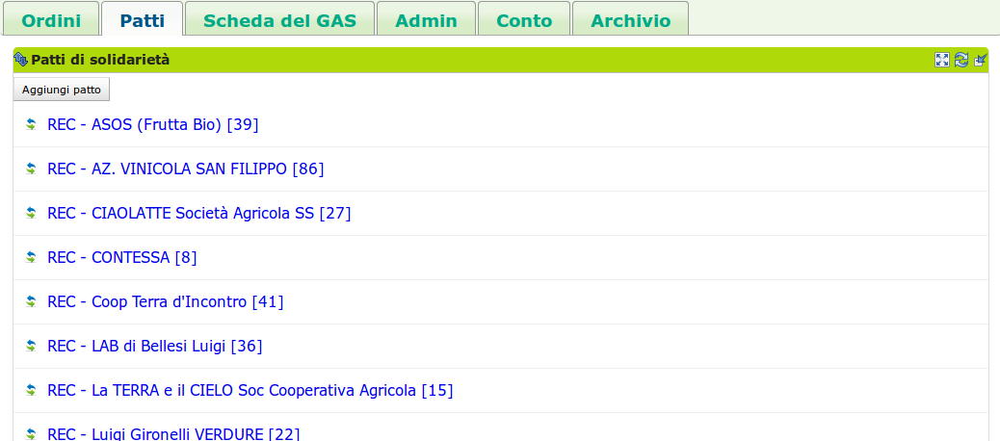

.. _role-gasreferrertech:

Il referente informatico del GAS
================================

Descrizione
-------------

Il referente informatico del :ref:`GAS <resource-gas>`  è un :ref:`gasista <role-gasmember>` che si occupa dell'amministrazione informatica del sistema, limitatamente agli aspetti relativi al GAS di appartenenza.
È suo compito impostare il modo in cui i gasisti ordinano i prodotti, la sede, la quota di adesione, il luogo di consegna predefinito e altre caratteristiche del GAS. 
È sempre lui che assegna i ruoli agli altri gasisti, in modo che essi possano eseguire le azioni di loro competenza.

.. WARNING::
    Il referente informatico del GAS è un utente che ha ampi margini di azione nel software.
    Può infatti eseguire molte delle operazioni eseguibili dal referente informatico del DES.
    Tale possibilità richiede una certa attenzione nell'interazione con la piattaforma.

Azioni
---------------

Configurare il GAS
^^^^^^^^^^^^^^^^^^

Una volta che un nuovo GAS viene inserito, è possibile configurarlo tramite la scheda  di configurazione del GAS secondo le proprie esigenze, in modo da adeguare il software all'**identità del prprio GAS**. 

Un GAS può essere configurato in due modi:

* andando nella pagina del GAS, nella "Scheda del GAS" -->  blocco Dettagli premendo il pulsante Configura;
* da menù contestuale del GAS

In un GAS è possibile configurare:

* luogo e giorno predefinito del ritiro dei prodotti;
* modalità di visualizzazione dei prodotti;
* la possibilità di confermare in mamiera automatica gli ordini dei gasisti;
* alcuni opzioni di selezione e filtraggio su ordini e consegne.

    Pannello di configurazione del GAS

Assegna i ruoli
^^^^^^^^^^^^^^^^^^^^^

All'interno di ogni GAS i singoli gasisti possono rivestire vari ruoli, e un ruolo può essere attribuito a più di un gasista.

Il referente informatico ha il compito di gestire l'assegnazione dei ruoli all'interno del proprio GAS. I ruoli che è possibile assegnare ad un gasista sono :

* referente informatico;
* referente fornitore;
* referente economico;
* fornitore. 

Il referente informatico può assegnare i ruoli ai gasisti dalla schermata che ottiene nella scheda Scheda del GAS --> blocco Dettagli cliccando sul bottone Gestisci Ruoli. Nella schermata risultante il referente fornitore potrà scegliere:

* quale gasista rivestirà il nuvo ruolo; 
* il ruolo da assegnare al gasista.

    Schermata che offre i dettagli del GAS e la possibilità di modificarlo e configurarlo.

Abilitare un gasista
^^^^^^^^^^^^^^^^^^^^^

L'iscrizione di un utente a *Gasista Felice* è solo il primo passo necessario all'iscrizione ad un GAS. Infatti per poter entrare attivamente in un GAS e cominciare a ordinare, un utente registrato necessita l'abilitazione da parte del referente informatico del GAS a cui è interessato a partecipare.

Il referente informatico può gestire l'abilitazione degli utenti registrati che la richiedono dalla scheda Admin --> blocco Utenti cliccando sul bottone Modifica, selezionado o deselezionando (nel caso voglia disabilitare un gasista ) la voce "è attivo" nella riga che corrisponde all'utente.

    Visualizza e permette l'abilitazione degli utenti che fanno parte del GAS

.. include:: actions/add_supplier.rst

Aggiungere un patto di solidarietà
^^^^^^^^^^^^^^^^^^^^^^^^^^^^^^^^^^

Nel caso in cui in un GAS non dovessero esservi referenti fornitori, il referente informatico è abilitato ad aprire un patto di solidarietà a cui in seguito verrà associato un gasista con il ruolo di referente fornitore. Il referente informatico è comunque abilitato alla creazione di un patto di solidarietà anche nel caso in cui dei referenti fornitori fossero già presenti nel GAS.

Il referente informatico può creare un nuovo patto di solidarietà nella scheda Patti --> Patti di solidarietà premendo il bottone "Aggiungi Patto", che apre una schermata in cui andranno inseriti:

* fornitore
* data dell'accordo
* l'importo minimo per l'apertura dell'ordine
* alcuni dati sulla consegna
* uno o piu referenti fornitori per il patto di solidarietà

    Visualizza e permette l'aggiunta dei Patti di solidarietà tra il GAS e un fornitore

Terminologia
-------------

* GAS
* Configurazione del GAS
* Contatti del GAS

Da cosa parte
-------------

Il referente informatico del GAS trova già inserito nel sistema il proprio GAS.

