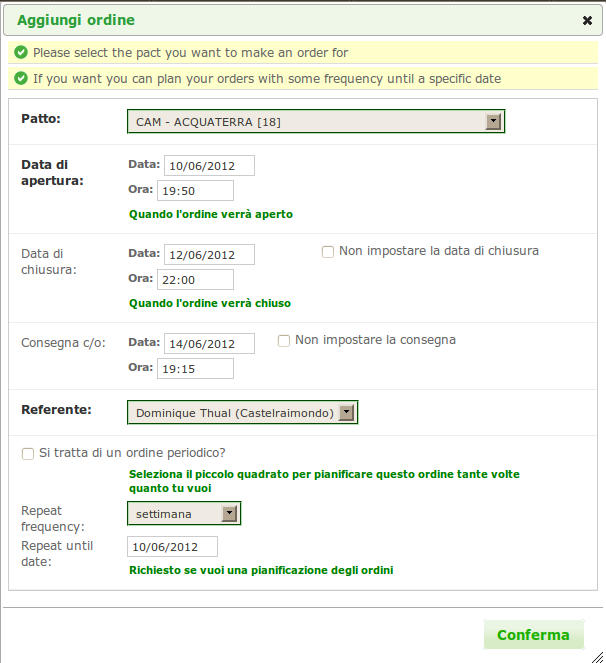
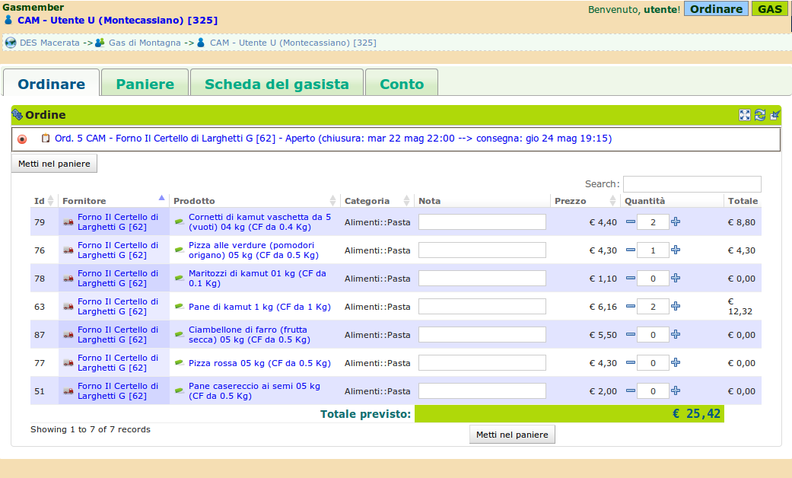
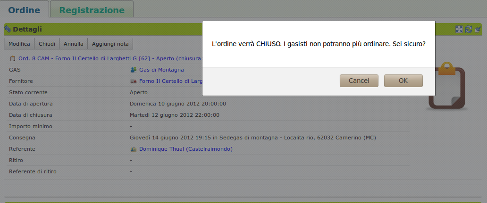
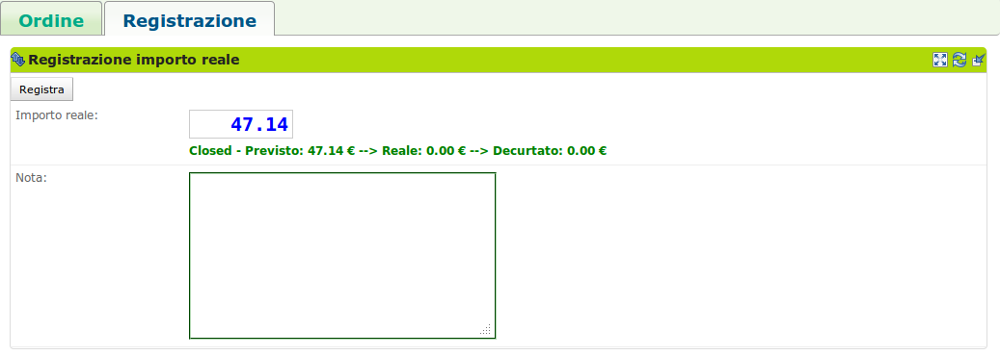
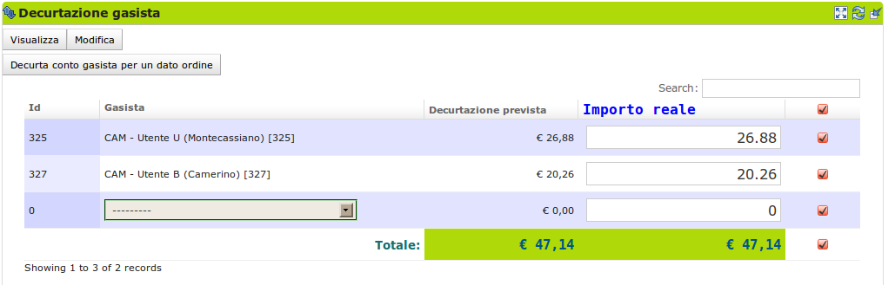
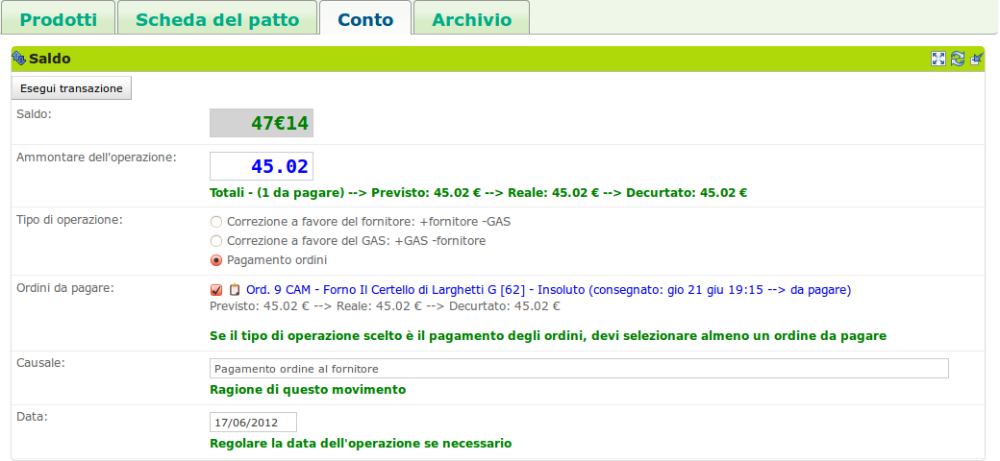
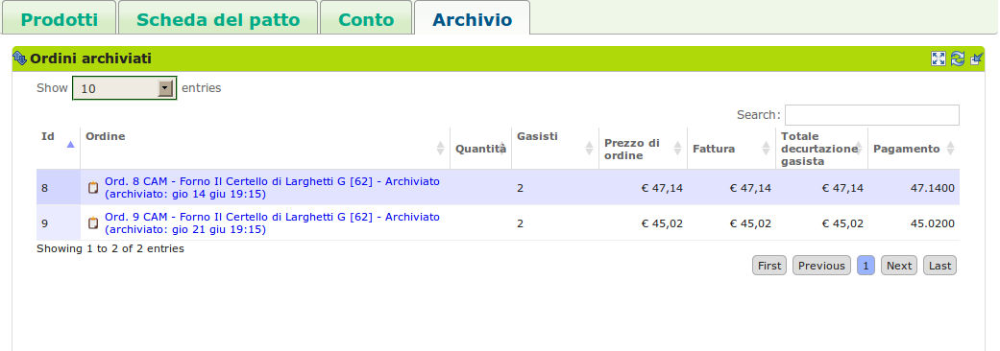

# L'ordine

## Descrizione

Un ordine che il [GAS](resource_gas.md) invia ad un [fornitore](supplier.md): è formato dall'insieme dei prodotti ordinati dai singoli gasisti che hanno preso parte all'ordine, scegliendo tra i prodotti disponibili nel listino del fornitore per quel particolare ordine.
Un ordine è inoltre caratterizzato da:

* il fornitore;
* il [patto di solidarietà](resource_pact.md) tra il GAS e il fornitore;
* la data di apertura e quella di chiusura;
* un appuntamento di consegna, cioè le modalità con cui il fornitore consegna al GAS la merce ordinata;
* un appuntamento di ritiro, cioè le modalità di distribuzione della merce ordinata ai gasisti;
* un eventuale importo minimo, sotto il quale il fornitore non accetta l'ordine.

La procedura attraverso cui i gasisti ordinano i prodotti è ben definita all'interno del software, e comprende i seguenti passi:

1. un gasista con il ruolo di [referente fornitore](gas_referrer_supplier.md) o [referente informatico](gas_referrer_tech.md) del proprio GAS crea l'ordine su un patto di solidarietà; a seconda della data di apertura dell'ordine, questo passa allo stato di:
* preparato, se la data è precedente a quella della creazione;
* aperto, se la data è quella della creazione.
durante questa fase viene anche impostata la data di chiusura se si desidera che l'ordine venga chiuso automaticamente, altrimenti si puo anche scegliere che l'ordine rimanga aperto fino alla chiusura manuale da parte di una delle due figure che possono aprire/preparare l'ordine.

> Un gasista abilitato apre l'ordine.

2. una volta che l'ordine è aperto, i gasisti possono cominciare a inserire nei propri panieri i prodotti che il fornitore del patto di solidarietà ha reso disponibili tra quelli nel suo listino.

> I gasisti inseriscono nei propri panieri i prodotti che desiderano acquistare.

3. una volta che tutti i gasisti hanno confermato i propri panieri (se il GAS lo richiede) e l'ordine è stato chiuso e consegnato, l'importo reale pagato ai fornitori per i prodotti deve essere registrato nel GAS e decurtato dai conti dei gasisti.
La registrazione e la decurtazione sono azioni che posson essere intraprese solamente dal referente informatico su qualsiasi ordine chiuso del suo GAS.
In particolare, durante la decurtazione è possibile includere anche altri gasisti che si sono inseriti successivamente nell'ordine, ad esempio perchè il fornitore ha consegnato dei prodotti in più che sono stati ritirati, appunto, da un altro gasista.

> Un gasista abilitato chiude l'ordine.

> Un gasista abilitato registra l'importo reale pagato per l'ordine consegnato

> Un gasista abilitato decurta ai gasisti l'importo dovuto per i prodotti ritirati

4. una volta che l'importo dell'ordine è stato decurtato, l'ordine passa nello stato di insoluto e puo essere pagato dal [referente contabile](gas_referrer_cash.md) del GAS utilizzando il conto del patto di solidarietà su cui l'ordine era stato aperto.

> Un referente contabile paga l'ordine registrato

5. infine, in seguito al pagamento, l'ordine passa automaticamente nello stato archiviato, per cui non viene piu influenzato da eventuali modifiche applicate ai listini dei prodotti dei fornitori nel DES o nel GAS. È possibile visualizzare gli ordini archiviati sia dalla pagina del patto di solidarietà che dalla pagina del GAS su cui il patto di solidarietà stesso è stato attivato.

> Un ordine archiviato.

## Terminologia

* Report gasista
* Report dell'ordine
* Ritiro
* Consegna

## Opzioni di configurazione

Le opzioni di configurazione del GAS che influiscono sull'ordine.

Il software offre un'elevata possibilità di configurazione del GAS; molte delle opzioni che possono essere configurate, inoltre, vanno ad influire sull'ordine che il GAS esegue sul patto di solidarietà.
Di seguito sono elencate le opzioni riguardanti l'ordine che possono essere configurate nel GAS:

* visualizzazine solo della prossima consegna: rende possibile il filtraggio degli ordini in modo che i gasisti visualizzino solo quelli che condividono il prossimo appuntamento di ritiro;
* selezione di un ordine alla volta: limita la selezione a un solo un ordine aperto alla volta;
* conferma automatica degli ordini dei gasisti: se selezionato, gli ordini dei gasisti vengono automaticamente confermati, altrimenti ogni gasista deve confermare manualmente i propri ordini;
* giorno, ora e minuto predefinito di chiusura degli ordini;
* giorno, ora e minuto predefinito della settimana di consegna degli ordini;
* possibilità di cambiare il luogo di consegna ad ogni ordine: se selezionata, rende possibile specificare il luogo della consegna ad ogni ordine. Se non selezioanta, il GAS usa solo il luogo predefinito di consegna nel caso questo sia definito, altrimenti la sede del GAS.
* luogo di consegna predefinito: va specificato se diverso dal luogo di ritiro;
* possibilità di cambiare il luogo di ritiro ad ogni ordine:  se selezionata, è possibile specificare il luogo di ritiro ad ogni ordine. Se non selezionata, il GAS usa solo il luogo predefinito di ritiro nel caso questo sia deinito, altrimenti la sede del GAS.
* luogo di ritiro predefinito: va specificato se è diverso dalla sede;
* giorni di preavviso prima della chiusura dell'ordine: quanti giorni prima si vuole ricevere un promemoria degli ordini di chiusura del GAS.

Nell'immagine seguente è possibile osservare come tutte le opzioni sopra elencate siano effettivamente configurabili:

> La schermata di configurazione del GAS, dove è possibile personalizzare le opzioni per l'ordine.

## Relazioni con le altre risorse del DES

* patto di solidarietà
* Ordini dei gasisti
* Referenti
