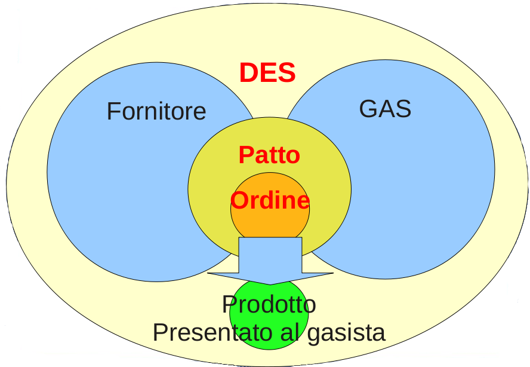
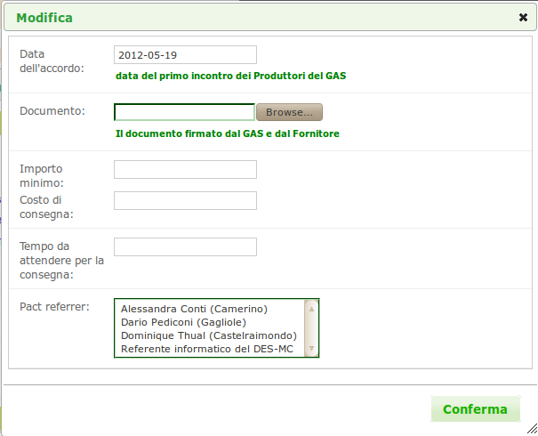

.. _resource-pact:

Il patto di solidarietà
=======================

|head2_descr|
-------------

Il Patto di Solidarietà è l'insieme delle condizioni di fornitura, economiche e non, condivise e sottoscritte da un :ref:`GAS <resource-gas>` e un :ref:`fornitore <role-supplier>`. È composto da diversi punti, di cui i principali sono :

* il catalogo del fornitore per il |res_gas|, cioè i prodotti che il |res_gas| sceglie di includere nei suoi :ref:`ordini <resource-order>` verso il |res_supplier|, scelti tra quelli resi disponibili dal |res_supplier| stesso; 
* i gasisti che fungono da :ref:`referenti fornitore <role-gasreferrersupplier>` per il |res_supplier|;
* quanti giorni prima della consegna è necessario chiudere l'ordine;
* le spese di consegna per ogni ordine.

per una descrizione dettagliata di come è possibile configurare il |res_pds|, andare alla sezione di :ref:`modifica del patto <pact-options>`.

Il |res_pds| è una risorsa fondamentale nel |res_des|, poichè è il tramite attraverso il quale i gasisti sono in grado di ordinare prodotti. Infatti, benchè sia un |res_supplier| a consegnarli fisicamente, in realtà è il |res_pds| stesso a fungere da contesto per l'ordine tra il |res_gas| e un particolare |res_supplier| tra quelli attivi nel |res_des|.

Nella pratica, il percorso intrapreso dal prodotto comprende tre passi:

* il |res_supplier| si affaccia sul |res_des|: in questo momento non viene ancora considerato attivo, poichè non è associato a nessun |res_pds|;
* il |res_supplier| viene associato as un |res_pds| con un |res_gas|, e da questo momento in poi viene considerato attivo nel |res_des| (può comunque essere collegato a piu di un |res_pds|, ognuno con un |res_gas| diverso);
* il |res_gas| apre un ordine sul |res_pds| scegliendo tra i prodotti disponibili nel listino del |res_supplier| quelli ordinabili dai gasisti.

Nella figura sottostante, per chiarezza, mostriamo il percorso intrapreso dal prodotto nel |res_des|, dal |res_supplier| al |res_gas|:

    
    Percorso del prodotto dal |res_supplier| al |res_gasmember|

|head2_terms|
-------------

* Listino |res_supplier|
* Listino |res_supplier| per il |res_gas|
* Ordine

.. _pact-options:

|head2_options|
---------------

Il software offre l'opportunità di configurare ogni aspetto del |res_pds|, in particolare:

* la data dell'accordo, ovvero anno, mese e giorno in cui il |res_pds| è stato stipulato;
* un copia elettronica del Documento, un patto bilaterale firmato dal |res_gas| e dal |res_supplier| interessato che contiene gli accordi solidali che entrambe le parti si impegnano di rispettare, ad esempio la trasparenza sui processi produttivi del |res_supplier| e l'adempimento degli impegni economici, da parte dei gasisti, in seguito alla fornitura.
* le spese di consegna che è necessario affrontare alla consegna di un ordine del |res_supplier|;
* il tempo da attendere prima della consegna,ovvero l'itervallo minimo che intercorre tra la chiusura dell'ordine da parte del |res_gas| e l'effettiva consegna dei prodotti da parte del |res_supplier|;
* una lista dei membri del |res_gas| a cui il |res_supplier| è collegato attraverso il |res_pds|, tra cui è possibile scegliere uno o più referenti fornitori per il patto stesso.
* l'eventuale importo minimo al di sotto del quale le parti concordano che non è possibile far partire un ordine.

    
    Schermata per la configurazione del |res_pds|

|head2_relations|
-----------------

* :ref:`GAS <resource-gas>` 
* :ref:`Fornitore <role-supplier>`
* :ref:`Ordine <resource-order>` 
* :ref:`Gasista <role-gasmember>`
* :ref:`Referente fornitore <role-gasreferrersupplier>` 
