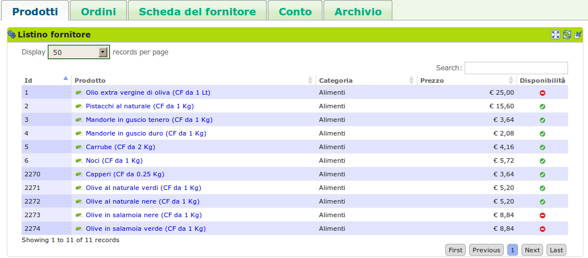
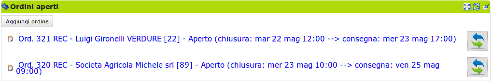
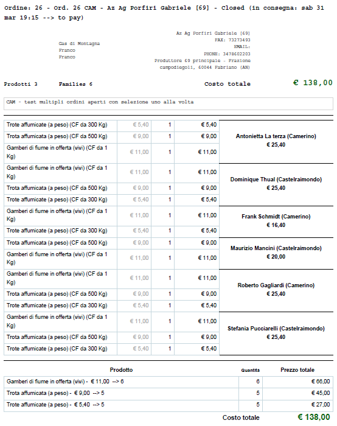
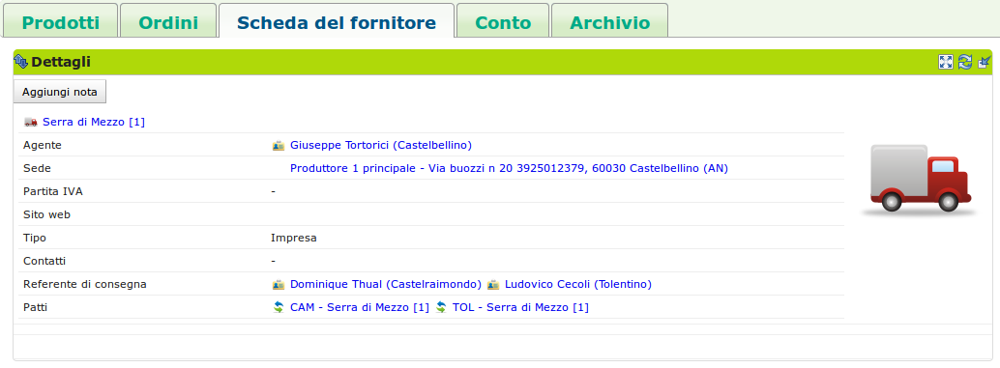
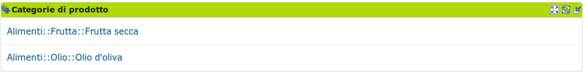
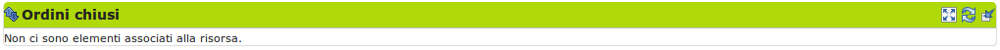

# Il fornitore

## Descrizione

Un utente con ruolo fornitore gestisce il listino dei prodotti che offre al DES. È suo compito modificare anche le informazioni fornitore come soggetto giuridico (scheda fornitore).

**Le modifiche fatte dal fornitore si riflettono su tutto il DES**.

Un fornitore entra in relazione con un gas attraverso un [patto di solidarietà](resource_pact.md). È proprio riferendosi ad esso che un [referente fornitore](gas_referrer_supplier.md) del GAS (non il fornitore!) potrà aprire gli ordini, gestirli ed eventualmente disabilitare alcuni prodotti che il proprio GAS non intende acquistare.

Una modifica in un prodotto nel listino del fornitore (anche nella disponibilità e nel prezzo) agisce in cascata sui prodotti ordinabili o anche già ordinati dai GAS in relazione con esso.

> In questa scheda viene descritto il fornitore in quanto utente del DES, non come soggetto giuridico (scheda del fornitore).

## Azioni

### Gestisce il listino

La pagina iniziale del fornitore, dopo l'autenticazione, mostra il listino di prodotti (scheda Prodotti -> blocco Listino Fornitore) che il fornitore offre a tutto il DES. In questo punto, premendo il bottone "Modifica" è possibile modificare agevolmente nome, disponibilità, prezzo.

Per aggiungere un nuovo prodotto o modificare parametri meno usati, si faccia riferimento al paragrafo :ref:`products_form`

Si ricorda che le modifiche fatte in questo listino verranno **applicate a tutto il DES**, anche ai prodotti ordinati negli ordini già aperti dei GAS e vengono, nel caso, notificate ai gasisti grazie al sistema di notifica del DES.

> Visualizzazione e gestione del listino del fornitore a livello DES.

### Visualizza gli ordini

Nella scheda Ordini --> blocco Ordini aperti, il fornitore visualizza in qualsiasi momento gli ordini dei GAS con cui ha un patto di solidarietà. Può inoltre visualizzare gli ordini che sono stati pianificati da un GAS nella scheda Ordini --> blocco Ordini preparati. Si evidenzia che in qualunque momento il GAS può annullare un ordine preparato o aperto.

> Visualizzazione degli ordini

### Riceve il documento di ordine

Una volta che l'ordine è stato chiuso il fornitore riceve via e-mail dal referente fornitore un documento pdf con il riepilogo dell'ordine, comprendente:

* nella testata del documento, i dati dell’ordine ( numero dell’ordine, dati produttore, dati del referente);
* una griglia che presenta le prenotazione per famiglia con i relativi sotto totali;
* una griglia che aggrega le quantità ordinate dei prodotti con i relativi sotto totali.

> Un esempio di documento di riepilogo dell'ordine in formato pdf.

.. _products_form:

### Aggiunge prodotti / modifica parametri meno usati

Per aggiungere un nuovo prodotto, si deve cliccare sul bottone "Aggiungi" nella scheda Prodotti --> blocco Listino Prodotti. In questo modo è possibile impostare i seguenti parametri:

* nome
* prezzo
* IVA
* categoria
* tipologia e unità di confezionamento
* quantità minime ordinabili

è disponibile anche una sezione a gestione del fornitore per definire le proprie categorie e propri codici prodotto.

Per modificare questi stessi parametri in un prodotto già inserito è sufficiente cliccare sul prodotto visualizzato nel listino e poi premere "Modifica" nel blocco dei "Dettagli" nella pagina che verrà visualizzata (risorsa prodotto).

### Modifica la scheda del fornitore

Un fornitore può visualizzare e modificare i dati che lo riguardano nella scheda Scheda del Fornitore --> blocco Dettagli. All'interno di questo blocco sono presenti tre bottoni:

* "modifica": permette al fornitore di modificare i suoi dati relativi a nome, sede, contatti (telefono ed e-mail), tipo di impresa e Agente collegato;
* "configura": permette al fornitore di decidere se ricevere via e-mail gli ordini a lui diretti quando pronti;
* "aggiungi nota": aggiunge una nota nel riquadro "note" posizionato a destra della scheda.

> Il blocco dove è possibile gestire i dati del fornitore, configurarlo e aggiungere note alla pagina.

Tramite il blocco Categorie di prodotto, il fornitore può visualizzare le categorie dei prodotti che ha precendentemente inserito nel proprio listino, mentre nel blocco Ordini chiusi può visualizzare gli ordini a lui riferiti che in quel momento sono nello stato chiuso.

> Visualizzazione delle categorie a cui i profotti offerti dal fornitore appartengono.

### Modifica le categorie di prodotto

Categorie di prodotto del fornitore. Sono identificate dal codice e dalla categoria fornitore.

### Visualizza l'archivio degli ordini

Nella scheda Archivio --> blocco Ordini archiviati, infine, il fornitore può consultare lo storico degli ordini che ha ricevuto dai GAS. I dati che il fornitore puo visualizzare per questi ordini sono:

* quantità: la quantità di beni ordinata;
* gasisti: i gasisti che hanno preso parte all'ordine;
* Prezzo di ordine: il totale previsto alla chiusura dell'ordine;
* fattura: il totale effettivo dell'ordine;
* totale decurtazione gasista: il totale decurtato dai conti dei gasisti;
* pagamento: il totale della fattura relativa a più ordini che include il totale effettivo dell'ordine visualizzato;

> Visualizza gli ordini relativi al fornitore che sono stati archiviati.

## Terminologia

* fornitore: Soggetto che fornisce un GAS di prodotti
* GAS: Gruppo di Acquisto Solidale
* Ordine: l'ordine che il referente fornitore apre, chiude ed invia al fornitore con i prodotti ordinati dai gasisti
* Prodotto: bene che un fornitore propone ad un GAS, è caratterizzato dal fornitore che lo produce e da una categoria di prodotto del DES
* Confezione: involucro del prodotto
* Quantità minima: ordinabile per un prodotto

## Da cosa parte

* Prodotti già inseriti
* Categorie di prodotto già inserite
* Scheda del fornitore già inserita
