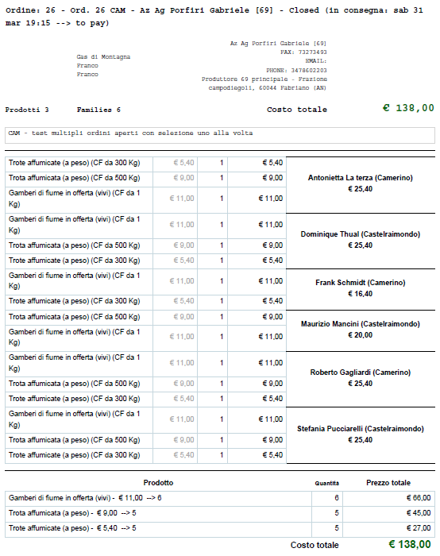
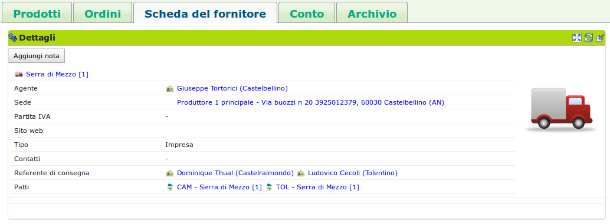
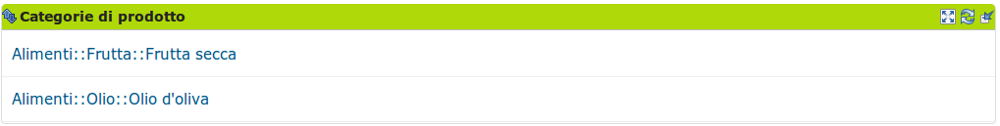

.. _role-supplier:

Il |res_supplier|
==================

|head2_descr|
-------------

Un utente con ruolo |res_supplier| gestisce il listino dei prodotti che offre al |res_des|. È suo compito modificare anche le informazioni |res_supplier| come soggetto giuridico (scheda |res_supplier|). 

**Le modifiche fatte dal |res_supplier| si riflettono su tutto il |res_des|**. 

Un |res_supplier| entra in relazione con un gas attraverso un :ref:`patto di solidarietà <resource-pact>`. È proprio riferendosi ad esso che un :ref:`referente fornitore <role-gasreferrersupplier>` del |res_gas| (non il |res_supplier|!) potrà aprire gli ordini, gestirli ed eventualmente disabilitare alcuni prodotti che il proprio |res_gas| non intende acquistare.

Una modifica in un prodotto nel listino del |res_supplier| (anche nella disponibilità e nel prezzo) agisce in cascata sui prodotti ordinabili o anche già ordinati dai |res_gas| in relazione con esso.

.. NOTE::
    In questa scheda viene descritto il |res_supplier| in quanto utente del |res_des|, non come soggetto giuridico (scheda del |res_supplier|). 

|head2_actions|
---------------

Gestisce il listino
^^^^^^^^^^^^^^^^^^^^

La pagina iniziale del |res_supplier|, dopo l'autenticazione, mostra il listino di prodotti (scheda Prodotti -> blocco Listino Fornitore) che il |res_supplier| offre a tutto il |res_des|. In questo punto, premendo il bottone "Modifica" è possibile modificare agevolmente nome, disponibilità, prezzo.

Per aggiungere un nuovo prodotto o modificare parametri meno usati, si faccia riferimento al paragrafo :ref:`products_form`

Si ricorda che le modifiche fatte in questo listino verranno **applicate a tutto il |res_des|**, anche ai prodotti ordinati negli ordini già aperti dei |res_gas| e vengono, nel caso, notificate ai gasisti grazie al sistema di notifica del |res_des|. 

.. figure:: _static/stocks.png
    :alt: Schermata del listino del fornitore.
    :align: center
    
    Visualizzazione e gestione del listino del |res_supplier| a livello |res_des|.    

Visualizza gli ordini
^^^^^^^^^^^^^^^^^^^^^^^^^

Nella scheda Ordini --> blocco Ordini aperti, il |res_supplier| visualizza in qualsiasi momento gli ordini dei |res_gas| con cui ha un |res_pds|. Può inoltre visualizzare gli ordini che sono stati pianificati da un |res_gas| nella scheda Ordini --> blocco Ordini preparati. Si evidenzia che in qualunque momento il |res_gas| può annullare un ordine preparato o aperto.

.. figure:: _static/open_orders.png
    :alt: Scheda degli ordini
    :align: center
    
    Visualizzazione degli ordini

Riceve il documento di ordine
^^^^^^^^^^^^^^^^^^^^^^^^^^^^^^^^^^^^^

Una volta che l'ordine è stato chiuso il |res_supplier| riceve via e-mail dal referente fornitore un documento pdf con il riepilogo dell'ordine, comprendente:

* nella testata del documento, i dati dell’ordine ( numero dell’ordine, dati produttore, dati del referente);
* una griglia che presenta le prenotazione per famiglia con i relativi sotto totali;
* una griglia che aggrega le quantità ordinate dei prodotti con i relativi sotto totali.

    
    Un esempio di documento di riepilogo dell'ordine in formato pdf.

.. _products_form:

Aggiunge prodotti / modifica parametri meno usati
^^^^^^^^^^^^^^^^^^^^^^^^^^^^^^^^^^^^^^^^^^^^^^^^^^^^^^^^^^^^^^^

Per aggiungere un nuovo prodotto, si deve cliccare sul bottone "Aggiungi" nella scheda Prodotti --> blocco Listino Prodotti. In questo modo è possibile impostare i seguenti parametri:

* nome
* prezzo
* IVA
* categoria
* tipologia e unità di confezionamento
* quantità minime ordinabili

è disponibile anche una sezione a gestione del |res_supplier| per definire le proprie categorie e propri codici prodotto.

Per modificare questi stessi parametri in un prodotto già inserito è sufficiente cliccare sul prodotto visualizzato nel listino e poi premere "Modifica" nel blocco dei "Dettagli" nella pagina che verrà visualizzata (risorsa prodotto).

Modifica la scheda del |res_supplier|
^^^^^^^^^^^^^^^^^^^^^^^^^^^^^^^^^^^^^^

Un |res_supplier| può visualizzare e modificare i dati che lo riguardano nella scheda Scheda del Fornitore --> blocco Dettagli. All'interno di questo blocco sono presenti tre bottoni:

* "modifica": permette al |res_supplier| di modificare i suoi dati relativi a nome, sede, contatti (telefono ed e-mail), tipo di impresa e Agente collegato; 
* "configura": permette al |res_supplier| di decidere se ricevere via e-mail gli ordini a lui diretti quando pronti;
* "aggiungi nota": aggiunge una nota nel riquadro "note" posizionato a destra della scheda.

    
    Il blocco dove è possibile gestire i dati del |res_supplier|, configurarlo e aggiungere note alla pagina.

Tramite il blocco Categorie di prodotto, il |res_supplier| può visualizzare le categorie dei prodotti che ha precendentemente inserito nel proprio listino, mentre nel blocco Ordini chiusi può visualizzare gli ordini a lui riferiti che in quel momento sono nello stato chiuso.

    
    Visualizzazione delle categorie a cui i profotti offerti dal |res_supplier| appartengono.

Modifica le categorie di prodotto
^^^^^^^^^^^^^^^^^^^^^^^^^^^^^^^^^^

Categorie di prodotto del |res_supplier|. Sono identificate dal codice e dalla categoria |res_supplier|.

Visualizza l'archivio degli ordini
^^^^^^^^^^^^^^^^^^^^^^^^^^^^^^^^^^^^^^

Nella scheda Archivio --> blocco Ordini archiviati, infine, il |res_supplier| può consultare lo storico degli ordini che ha ricevuto dai |res_gas|. I dati che il |res_supplier| puo visualizzare per questi ordini sono:

* quantità: la quantità di beni ordinata;
* gasisti: i gasisti che hanno preso parte all'ordine;
* Prezzo di ordine: il totale previsto alla chiusura dell'ordine;
* fattura: il totale effettivo dell'ordine;
* totale decurtazione |res_gasmember|: il totale decurtato dai conti dei gasisti;
* pagamento: il totale della fattura relativa a più ordini che include il totale effettivo dell'ordine visualizzato;

.. figure:: _static/stored_orders.png
    :alt: Ordini archiviati relativi al fornitore.
    :align: center
    
    Visualizza gli ordini relativi al |res_supplier| che sono stati archiviati.

|head2_terms|
-------------

* |res_supplier|: Soggetto che fornisce un |res_gas| di prodotti
* |res_gas|: Gruppo di Acquisto Solidale
* Ordine: l'ordine che il referente fornitore apre, chiude ed invia al |res_supplier| con i prodotti ordinati dai gasisti
* Prodotto: bene che un |res_supplier| propone ad un |res_gas|, è caratterizzato dal |res_supplier| che lo produce e da una categoria di prodotto del |res_des|
* Confezione: involucro del prodotto
* Quantità minima: ordinabile per un prodotto

|head2_start|
-------------

* Prodotti già inseriti
* Categorie di prodotto già inserite
* Scheda del |res_supplier| già inserita
